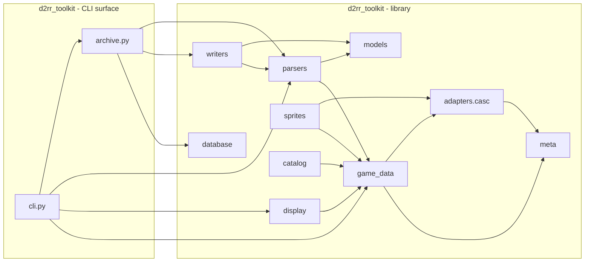

# Architecture

> Generated: 2026-04-20; verify against source before trusting.

This document gives a contributor the fastest possible "what talks to
what" picture of the codebase. For the binary format of the save files
themselves see `docs/spec/d2s_format_spec.md`; for the verification
history see `VERIFICATION_LOG.md`.

## High-level layout



The package is a single `d2rr_toolkit` namespace. Inside it, `cli`
and `archive` form the CLI surface; everything else is the library.
`parsers` and `writers` both depend on `models`; `display` depends
on `game_data` + `models`; everything that reads game files goes
through `adapters.casc`.

## Package responsibilities

### `src/d2rr_toolkit/`

- **`parsers/`** - Bit-level reader pipeline. `D2SParser` turns a
  raw `.d2s` file into `ParsedCharacter`; `D2IParser` does the same
  for `.d2i`. Each parser auto-loads its required game-data
  singletons on entry (item types, ISC, skills, charstats) and
  fails-loud with `GameDataNotLoadedError` if loading is blocked.
- **`writers/`** - Byte-splice writers that rewrite a source file
  in place. Writer invariants are enforced as explicit
  `D2SWriteError` raises (survives `python -O`). Every write path
  goes through `backup.create_backup()` first.
- **`models/`** - Pydantic models describing everything the parsers
  emit (`ParsedCharacter`, `ParsedItem`, `ItemFlags`,
  `ItemExtendedHeader`, etc.). Depends on nothing else in the
  toolkit.
- **`game_data/`** - Loaders for the Reimagined / vanilla game-data
  files (`item_types`, `item_stat_cost`, `skills`, `sets`,
  `uniques`, `properties`, `property_formatter`, ...). Each loader
  is transparently backed by the HMAC-signed pickle cache
  (`meta.cache`).
- **`display/`** - Terminal-rendering helpers consumed by the CLI.
  Quality colours, tier suffixes, damage / defense formatters.
- **`sprites/`** - Bulk sprite preloader plus the alias registry
  for unique / set sprite overrides.
- **`database/`** - SQLite wrappers: `ItemDatabase` (archive) and
  `Section5Database` (gems / materials / runes). SC / HC isolation
  enforced via a meta-table tag (`project_refactor_2026-04-11`).
- **`meta/`** - The persistent pickle cache (`cached_load` +
  HMAC signing), source-version fingerprinting, and the version
  resolver that consults `.build.info` + `modinfo.json`.
- **`adapters/casc/`** - CASC archive reader. Dynamic TVFS root
  parsing, Reimagined-mod-first overlay semantics.
- **`catalog/`** - Composed item catalog built on top of
  `item_types` + `item_names` for display purposes.
- **`exceptions.py`** - `ToolkitError` hierarchy (parser, writer,
  Huffman, CASC errors).
- **`cli.py`** - Typer CLI entry point (`d2rr-toolkit` binary).
  Defines every sub-command (parse, inspect, archive, stash, ...),
  wires them to the archive layer, renders output via `display/`.
- **`archive.py`** - High-level `extract_from_d2i` /
  `restore_to_d2i` orchestrators: backup -> parse -> mutate -> write
  -> post-write verify with auto-rollback. Refuses to archive
  unidentified items.

## Data flow

A typical flow for the `inspect` command:

```text
.d2s bytes
    │
    ▼
D2SParser.parse()      <- auto_load_game_data()
    │                    (item_types, ISC, skills, charstats)
    ▼
ParsedCharacter        <- pydantic model, canonical snapshot
    │
    ├─► display/ (Rich panel render)
    │       └─► PropertyFormatter.format_properties_grouped(
    │               item=item, roll_context=ctx, breakdown=True)
    │             └─► StatBreakdownResolver (per-stat attribution)
    │
    ├─► catalog.ItemCatalog (for sprite + name lookups)
    │
    └─► ItemDatabase.store_item(item)  <- on `archive extract`
```

Writer flow (`archive extract` end):

```text
modified ParsedStash
    │
    ▼
D2IWriter.build()
    ├─► _splice_section(...) for touched tabs
    ├─► _self_check() (post-build integrity: canonical empty, trailer)
    ▼
bytes blob (in memory)
    │
    ▼
archive.create_backup(save_path)   <- mandatory before write
    │
    ▼
atomic rename tmp -> save_path
    │
    ▼
archive._verify_d2i_on_disk(...)
    ├─► re-parse and diff against expected
    └─► on failure: rollback from backup + raise ArchiveError
```

## Verification-tag system

The toolkit tags every non-trivial binary-format claim with one of
three markers (full contract in
[`CONTRIBUTING.md`](../CONTRIBUTING.md#verification-tags); tag history
per field in [`VERIFICATION_LOG.md`](../VERIFICATION_LOG.md)):

- `[BV]` / `[BINARY_VERIFIED]` - the assertion was checked against
  real save files (usually a `tests/cases/TC##/` fixture). Safe to
  rely on in the parser path.
- `[TC##]` - the specific test case that pinned the assertion.
- `[SPEC_ONLY]` - taken from the public format spec, not yet
  binary-verified. Treat with caution.

Every new parser claim must carry one of the first two tags and
land a matching fixture + entry in `VERIFICATION_LOG.md`.

## Dependency rules

- `parsers/` **never** imports `database/`.
- `models/` **never** imports `parsers/` or `writers/`.
- `display/` consumes `models/` + `game_data/` only; it does not
  read files or CASC.
- `writers/` may import `parsers/` (for round-trip sanity
  self-checks) but not the reverse.
- Every file that touches game-data files on disk goes through
  `adapters/casc` - no direct `open(.../reimagined/...)` calls
  anywhere else.
